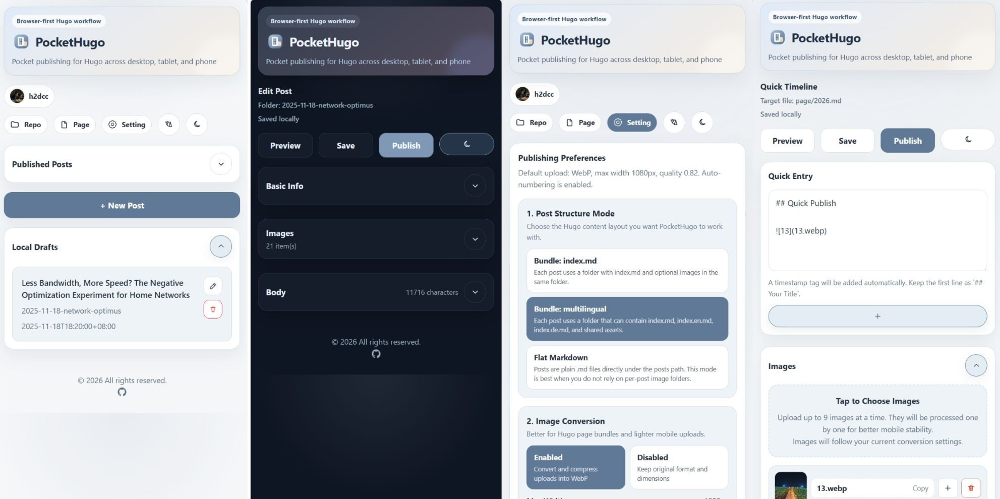
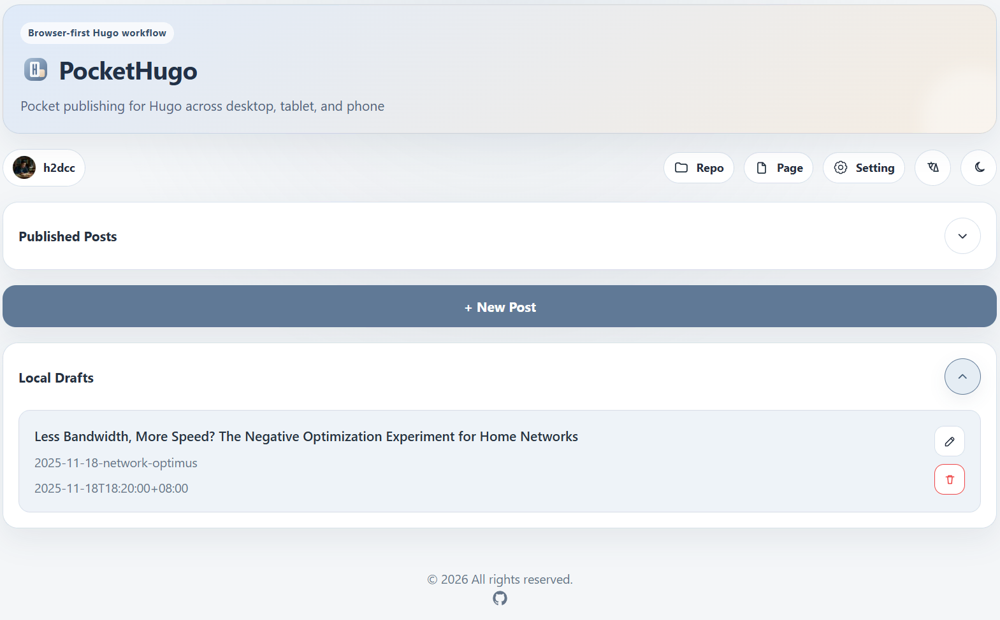

# PocketHugo

[English README](./README.md)






PocketHugo 是一个面向手机优先的 Hugo 发布工具，适用于把内容托管在 GitHub 的用户。

- 项目仓库：[https://github.com/h2dcc/pocket-hugo](https://github.com/h2dcc/pocket-hugo)
- 线上地址（Vercel）：[https://pockethugo.lawtee.com](https://pockethugo.lawtee.com)
- 线上地址（Cloudflare Workers）：[https://pocket-hugo.rpwi.workers.dev](https://pocket-hugo.rpwi.workers.dev)

## 项目优势

PocketHugo 核心目标是保留 Hugo 原生 page bundle 结构，同时把手机端写作和发布流程简化：

- 手机浏览器即可写作和改稿
- `index.md + 图片` 保持同目录，结构清晰
- 上传时即可压缩/转换图片
- 一次发布即可批量提交本次改动文件
- 不依赖单独的在线数据库保存你的文章内容

## 项目缘起（作者背景）

这个项目来自真实、高频的写作需求。

作为一个一年更新上百篇文章的 Hugo 重度用户，我长期经历过手机端写作、图片处理、Git 发布链路中的各种痛点。之前我尝试过很多现成方案，也做过很多技术摸索，但要么容易破坏 Hugo 原生目录结构，要么在日常使用中依然不够顺手。

最终我决定自己搭建 PocketHugo，专门解决这些长期反复出现的问题：保留 Hugo 原生结构、降低手机发布门槛、让高频更新更稳定。

### 长期折腾轨迹（可信度说明）

这不是一个短期拼出来的 Demo，而是经过长期实践迭代后的结果。下面是我持续折腾 Hugo 发布链路的一部分公开记录：

- 2024-06-02：手机上使用 StackEdit 发布 Hugo
- 2024-12-09：让 CMS 适配 Hugo 原生目录结构
- 2025-05-08：将 StackEdit 融入日常 Hugo 写作
- 2025-10-27：尝试通过 GitHub Issue / GitHub App 实现发布


一路试错、记录、重构到现在，PocketHugo 才算把“手机优先写作 + Hugo 原生结构 + 稳定发布”这条链路真正打通。

## 主要功能

### 文章发布流程

- GitHub OAuth 登录
- 选择仓库 / 分支 / 文章目录
- 本地草稿保存与继续编辑
- 从 GitHub 读取已发布文章并再次编辑
- 发布前二次确认
- 一次提交 Markdown 与图片等改动文件
- 发布成功页显示本次改动文件列表

### 图片工作流

- 支持图片自动转换与压缩
- 支持精细化设置最大宽度与质量
- 支持自动命名（`1.webp`、`2.webp`）
- 图片链接可插入到当前光标位置
- 在编辑器删除图片后，可在重发时同步删除远程图片
- 点击图片可预览大图并复制文件名

### 编辑体验

- 手机优先交互
- 基本信息 / 图片 / 正文 / Frontmatter 可折叠
- 正文支持 `/` 调出 Markdown 命令
- 预览区域自适应宽度，代码块支持换行
- 保留自动保存，同时提供手动保存按钮
- 支持浅色/深色与中英双语切换

### 页面编辑（独立页面 + 生活记录）

- 两种模式：
  - 独立页面（Standalone Page）
  - 生活记录（Quick Timeline）
- 页面编辑同样支持图片上传/插入/删除
- 支持 Frontmatter 编辑
- 支持将生活记录一键转为文章草稿

### 偏好与自定义

- 首页发布偏好配置
- Basic Info 字段映射可配置（`title/date/draft` 固定）
- 封面字段名可自定义（如 `image` 或 `featured-image`）
- 支持预设固定分类并快速点选
- Tags 采用英文逗号规则
- Frontmatter 时间支持时区偏好

## 架构与隐私

PocketHugo 采用本地优先思路：

- 草稿与偏好保存在用户浏览器
- 会话与配置通过加密 Cookie 存储在用户侧
- 服务端不维护文章内容数据库
- GitHub Token 只在服务端调用 GitHub API 时使用

## 技术栈

- Next.js（App Router）
- React + TypeScript
- GitHub OAuth + GitHub API
- OpenNext（Cloudflare Workers 适配）

## 环境要求

- 推荐 Node.js `22 LTS`
- npm

## 本地开发

```bash
npm install
npm run dev
```

创建 `.env.local`：

```env
APP_URL=http://localhost:3000
APP_SESSION_SECRET=replace-with-a-long-random-secret
GITHUB_CLIENT_ID=your-client-id
GITHUB_CLIENT_SECRET=your-client-secret
```

## 如何在 GitHub 获取 OAuth 环境值

进入：

`GitHub -> Settings -> Developer settings -> OAuth Apps -> New OAuth App`

然后按以下步骤：

1. 填写 `Application name`（例如 `PocketHugo Vercel`）
2. 填写 `Homepage URL`（你的部署域名）
3. 填写 `Authorization callback URL`：`https://你的域名/api/auth/callback`
4. 点击 **Register application**
5. 复制 **Client ID** 作为 `GITHUB_CLIENT_ID`
6. 点击 **Generate a new client secret**，复制为 `GITHUB_CLIENT_SECRET`


## 环境变量说明

所有环境都需要：

- `APP_URL`
- `APP_SESSION_SECRET`
- `GITHUB_CLIENT_ID`
- `GITHUB_CLIENT_SECRET`

生成 `APP_SESSION_SECRET` 示例：

```bash
node -e "console.log(require('crypto').randomBytes(32).toString('hex'))"
```

### Vercel 示例

```env
APP_URL=https://pockethugo.lawtee.com
APP_SESSION_SECRET=replace-with-a-long-random-secret
GITHUB_CLIENT_ID=your-vercel-oauth-client-id
GITHUB_CLIENT_SECRET=your-vercel-oauth-client-secret
```

### Cloudflare Workers 示例

```env
APP_URL=https://pocket-hugo.rpwi.workers.dev
APP_SESSION_SECRET=replace-with-a-long-random-secret
GITHUB_CLIENT_ID=your-workers-oauth-client-id
GITHUB_CLIENT_SECRET=your-workers-oauth-client-secret
```

## 部署到 Vercel

1. 在 Vercel 导入本仓库
2. 在 Project Settings 中配置环境变量
3. 构建命令：

```bash
npm run build:vercel
```

4. 执行部署

## 部署到 Cloudflare Workers

本仓库已包含：

- `wrangler.jsonc`
- `open-next.config.ts`

部署命令：

```bash
npm run build:cloudflare
```


## 安全建议

- 不要提交 `.env.local`
- 一旦密钥泄露，立刻轮换 `GITHUB_CLIENT_SECRET`
- 使用足够强的 `APP_SESSION_SECRET`
- OAuth 回调地址务必使用正式域名

## License

MIT
